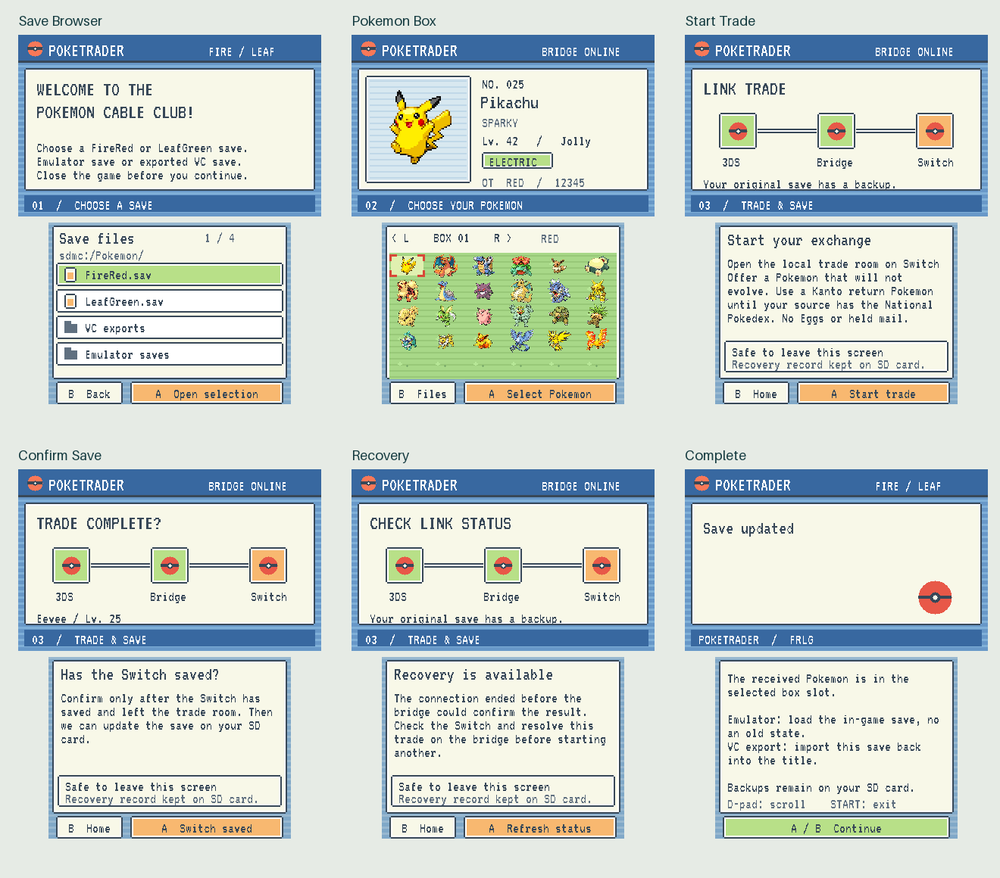

# PokeTrader

PokeTrader lets you trade boxed Pokemon between a FireRed or LeafGreen save on a homebrew-enabled Nintendo 3DS and FireRed or LeafGreen running on an unmodified Nintendo Switch.

The 3DS app lets you choose a save, browse its PC boxes, and select a Pokemon. A companion program on a Linux PC handles the trade with the Switch, updates the original save, and keeps recovery files in case the process is interrupted.

## Downloads

Get the current 3DS app and Linux bridge from the [latest GitHub release](https://github.com/DapperMickie/3DSPokeTrader/releases/latest). Releases include a HOME Menu CIA, a Homebrew Launcher build, an SD-card-ready archive, and the bridge source.

See [How to run PokeTrader](docs/how-to-run.md) for installation, setup, trading, recovery, and build instructions.

## Current status

PokeTrader is still a hardware-test build. Save handling, recovery, and communication between the app and bridge have automated tests, but a complete physical 3DS-to-Switch trade has not yet been confirmed.

It supports standard FireRed and LeafGreen saves. ROM hacks, save states, other Pokemon generations, eggs, held mail, and selecting Pokemon directly from the party are not supported.

## License

PokeTrader is licensed under AGPL-3.0-or-later. It does not include games, ROMs, Switch keys, or personal save data. Pokemon sprites remain copyright The Pokemon Company.
